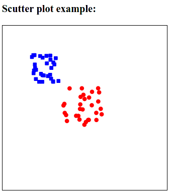
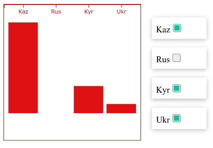
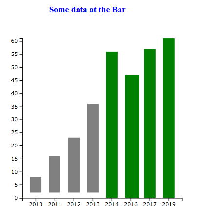
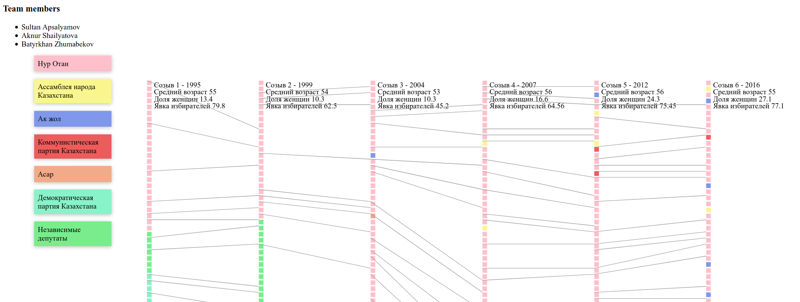
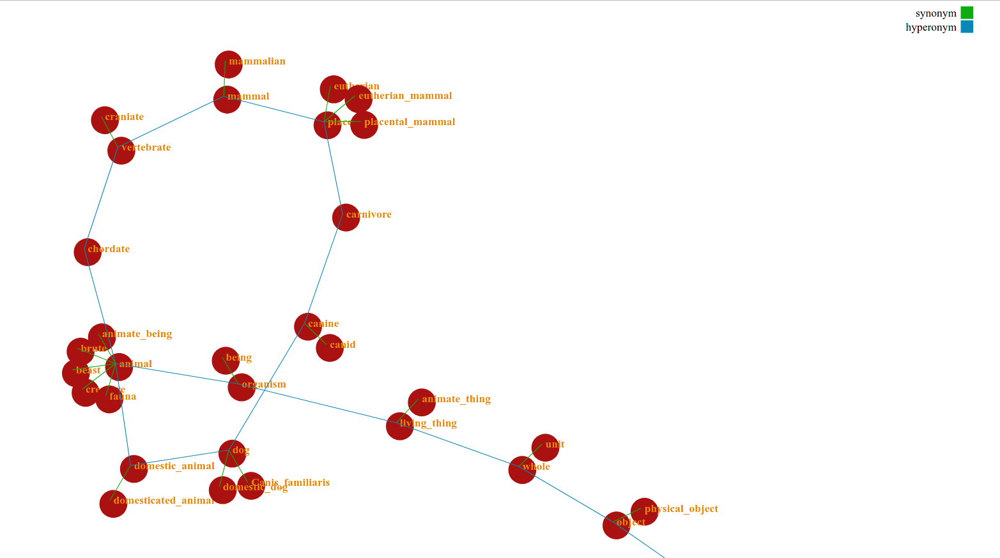

## Data Visualisation course fall 2020

Student: Sultan Apsalyamov

Assignment 1 - Scutter plot  
path: week2/hw1_scutter_plot/  

Assignment 2 - Bar switcher  
path: week2/  

Assignment 3 - Bar chart animation  
path: week4/  

Assignment 4 - Majilis  
path: week6_majilis_vis/  

Assignment 5 - WordNet   
path: week8_wordNet_vis/  

